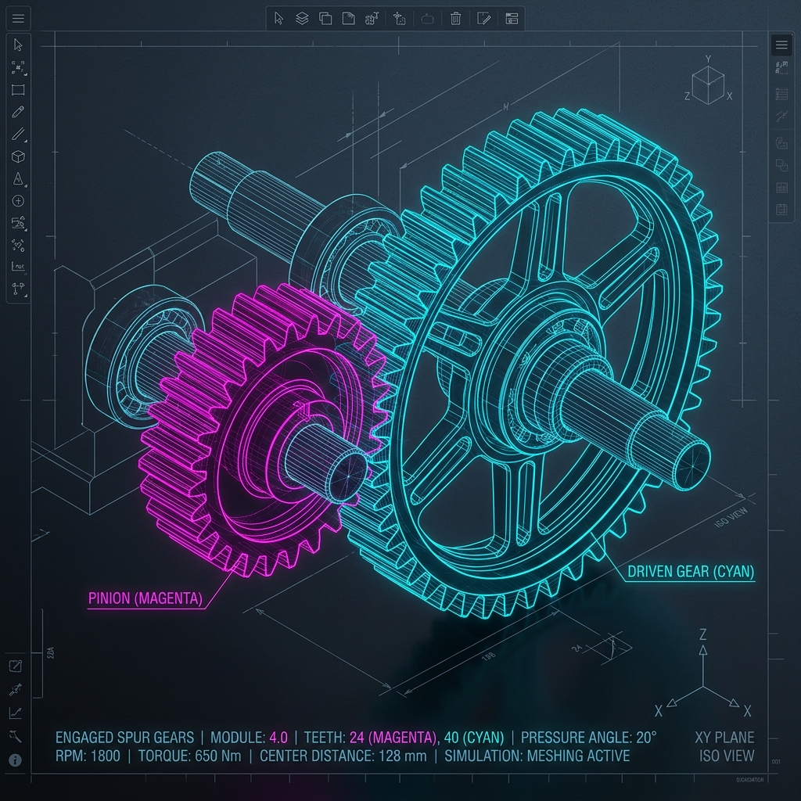

# ⚙️ Visual Gear Pair Calculator & CAD Exporter

> An advanced, browser-based engineering workspace for designing, simulating, and exporting spur gear pairs.

[](https://opensource.org/licenses/MIT)
[]()
[]()

---



---

## 🛠️ Overview

The **Visual Gear Pair Calculator** is a highly interactive, professional CAD utility designed for mechanical engineers, designers, and hobbyists. It combines high-accuracy gear math with beautiful real-time rendering, stress analysis, and industrial-grade export capabilities.

Whether you need to quickly check the bending safety factor of a gear mesh, find the optimal tooth count for a specific transmission ratio, or generate 3D STEP/2D DXF profiles for manufacturing, this application runs entirely client-side inside your browser with supreme performance.

---

## 🌟 Key Features

### 1. Interactive Visualizers (2D & 3D)
*   **Real-time 2D Engagement**: Vector-based SVG visualizer that animates the teeth in mesh. Supports full pan/zoom controls.
*   **3D WebGL Canvas**: Interactive 3D viewer powered by Three.js and React Three Fiber (R3F), allowing you to rotate, pan, and zoom to inspect tooth thickness, face width, and clearances.
*   **Mesh Animation Controls**: Play/pause buttons and a speed slider to simulate rotation at realistic speeds (defaults to low speed for comfortable inspection).

### 2. High-Accuracy Geometry Solver
*   **Operating Pressure Angle ($\alpha_w$)**: Newton-Raphson numerical solver to find the exact operating pressure angle under arbitrary center distance or profile shifts ($x_1, x_2$).
*   **Profile Shifts ($x_1, x_2$)**: Design gears with shifted profiles to prevent undercutting and balance bending stress.
*   **Clearance & Backlash**: Calculates exact tip, root, and pitch diameters, contact ratio ($g_\alpha$), and active tooth thickness.

### 3. Mechanical Loads & Lewis Stress Analysis
*   **Force Decomposition**: Resolves input power and rotational speed into tangential ($F_t$), radial ($F_r$), and normal ($F_n$) forces at the pitch circle.
*   **Lewis Tooth Strength**: Computes tooth bending stress using the classic Lewis formula combined with material yields to determine the safety factor.

### 4. Combinatorial Ratio Search Engine
*   *Stuck with matching target ratios?* Enter your target ratio and maximum spacing, and the search engine will iterate through combinations of modules ($m$) and tooth counts ($z_1, z_2$) to suggest the closest design fits within constraints.

### 5. Automated Engineering Reports & CAD Exports
*   **PDF Sizing Datasheet**: Generates a clean multi-page document with calculation equations, mechanical parameters, and a fully rendered 2D gear engagement layout (with option to toggle it).
*   **Industrial DXF Output**: Exports 2D layout lines (pinion, gear, or combined assembly) to DXF files with layers, ready for import into AutoCAD, SolidWorks, or laser-cutters.
*   **Solid 3D STEP Output**: Models exact involute tooth shapes in 3D using OpenCascade WebAssembly (`replicad`) and exports a solid STEP file offline.

---

## 🚀 Quick Start (Local Run)

The application is built using React 19, TypeScript, Vite, and `pnpm`.

### Prerequisites
*   [Node.js](https://nodejs.org/) (v18+)
*   [pnpm](https://pnpm.io/) (`npm i -g pnpm`)

### Installation & Run

1.  Clone the repository:
    ```bash
    git clone https://github.com/YurMil/gear-pair-calculator.git
    cd gear-pair-calculator
    ```

2.  Install dependencies:
    ```bash
    pnpm install
    ```

3.  Start the development server:
    ```bash
    pnpm run dev
    ```
    Open your browser and navigate to `http://localhost:5173`.

4.  Build for production:
    ```bash
    pnpm run build
    ```
    The static files will build into the `dist/` directory.

---

## 📐 Math & Theory

Gears are modeled using the **Involute profile**. The tooth profile is calculated by tracing the path of a string unwrapped from the base circle ($d_b = d \cdot \cos\alpha$).

The operating pressure angle $\alpha_w$ is solved using:
$$\text{inv}(\alpha_w) = 2 \cdot \frac{x_1 + x_2}{z_1 + z_2} \cdot \tan(\alpha) + \text{inv}(\alpha)$$
where the involute function is:
$$\text{inv}(\theta) = \tan(\theta) - \theta$$

To explore the full architecture, code modules, and algorithms, please check the [Documentation Folder](./docs/README.md).

---

## 📄 License
This project is licensed under the MIT License - see the [LICENSE](LICENSE) file for details.
